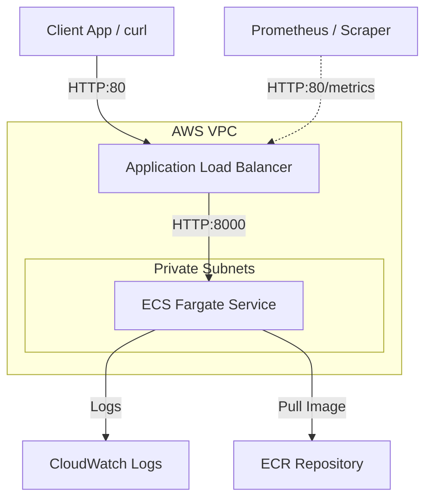

# Legal Document Classifier - MLOps Service

Production-grade microservice for classifying legal documents (contracts, lawsuits, complaints, requests) into categories using machine learning. The service is built with FastAPI and scikit-learn, containerized with Docker, monitored with Prometheus, and deployed on AWS ECS (Fargate) using Terraform.

## 📊 System Architecture



---

## 🛠️ Technology Stack

* **Machine Learning**: Python 3.10, scikit-learn, TF-IDF, Logistic Regression, Simplemma (multilingual lemmatization)
* **REST API**: FastAPI, Uvicorn, Pydantic
* **Monitoring**: Prometheus (via `prometheus-fastapi-instrumentator`)
* **Containerization**: Docker, Docker Compose
* **Infrastructure**: AWS VPC, ECS Fargate, ECR, Application Load Balancer (ALB), CloudWatch
* **IaC**: Terraform (>= 1.0)
* **CI/CD**: GitHub Actions

---

## 📁 Project Structure

```text
legal-document-classifier-mlops/
├── .github/workflows/      # CI/CD pipelines
│   └── deploy.yml         # Deployment workflow to AWS ECS
├── aws/                    # AWS local configuration templates
├── data/                   # Dataset directory
│   └── training_data.csv  # Training dataset (generated)
├── docker/                 # Containerization configs
│   ├── Dockerfile         # API application container definition
│   ├── docker-compose.yml # Local multi-container development
│   └── test_container.py  # Health and functionality tests inside Docker
├── src/                    # Source code
│   ├── main.py            # FastAPI application serving classifications
│   ├── nlp_utils.py       # Lemmatization utilities (ru, en, de, lt)
│   ├── prepare_data.py    # Training data preparation script
│   └── train_model.py     # Model training and evaluation script
├── terraform/              # Infrastructure as Code
│   ├── modules/           # Reusable Terraform modules (VPC)
│   ├── main.tf            # Main deployment configurations
│   ├── variables.tf       # Parameter declarations
│   └── outputs.tf         # Resource endpoints outputs
├── requirements.txt        # Python dependency manifest
├── run_api.py              # local API startup utility
├── test_api.py             # Integration test script
└── README.md              # Service documentation (this file)
```

---

## 🚀 Quick Start & Local Development

### 1. Installation

Clone the repository and install the dependencies:

```bash
git clone <your-repo-url>
cd legal-document-classifier-mlops

# Recommended: setup python virtualenv
python3 -m venv .venv
source .venv/bin/activate

# Install requirements
pip install -r requirements.txt
```

### 2. Model Training

Generate the training data and train the classifier:

```bash
# Generate synthetic dataset
python3 src/prepare_data.py

# Train the model with multilingual lemmatization
python3 src/train_model.py
```

### 3. Running API Service

Start the FastAPI application:

```bash
python3 run_api.py
```

The service will be available locally at `http://localhost:8000`.

---

## 🐳 Docker Deployment

### Local Container Execution

You can build and run the containerized API using the helper script or manual Docker commands:

```bash
# Build and run using the helper script
./docker/build_and_run.sh

# Or build and run manually
docker build -f docker/Dockerfile -t legal-classifier:latest .
docker run -d --name legal-classifier-api -p 8000:8000 legal-classifier:latest
```

### Docker Compose

Start the application using Docker Compose:

```bash
cd docker
docker-compose up --build
```

### Verification

Run the container integration tests:

```bash
python3 docker/test_container.py
```

---

## 📊 API Documentation & Endpoints

Interactive documentation is available at:
* **Swagger UI**: `http://localhost:8000/docs`
* **ReDoc**: `http://localhost:8000/redoc`

### Endpoints Overview

| Endpoint | Method | Description |
| :--- | :--- | :--- |
| `/` | `GET` | Service summary & version metadata |
| `/health` | `GET` | Service health status and loaded model details |
| `/classify` | `POST` | Predict the category for a legal document |
| `/classify/batch` | `POST` | Batch classification (up to 100 texts) |
| `/categories` | `GET` | Retrieve allowed categories and descriptions |
| `/model/info` | `GET` | Details about the currently active model pipeline |
| `/metrics` | `GET` | Prometheus instrumentation metrics endpoint |

### Classification Request Example

```bash
curl -X POST "http://localhost:8000/classify" \
     -H "Content-Type: application/json" \
     -d '{"text": "Supply agreement between ABC Corp and XYZ Ltd for goods delivery"}'
```

---

## 🏗️ AWS Production Deployment

Deployment utilizes Terraform to spin up VPC networking, ECR image registry, ECS Fargate compute, and ALB load balancing.

### 1. GitHub Actions (Automated CI/CD)

Configure GitHub Secrets for your repository:
* `AWS_ACCESS_KEY_ID`: Your AWS access key
* `AWS_SECRET_ACCESS_KEY`: Your AWS secret access key

Push to `main` or `develop` branch to trigger the automated test, build, and deploy pipeline.

### 2. Manual CLI Deployment

Configure AWS CLI and execute the deployment helper script:

```bash
# Log in to AWS CLI
aws configure

# Run automated pipeline deployment (creates resources, builds and pushes Docker image)
./deploy.sh sandbox
```

### Useful CLI Commands for Inspection

```bash
# View ECS service details
aws ecs describe-services --cluster legal-classifier-dev --services legal-classifier-dev

# Stream logs from CloudWatch
aws logs tail /ecs/legal-classifier-dev --follow
```